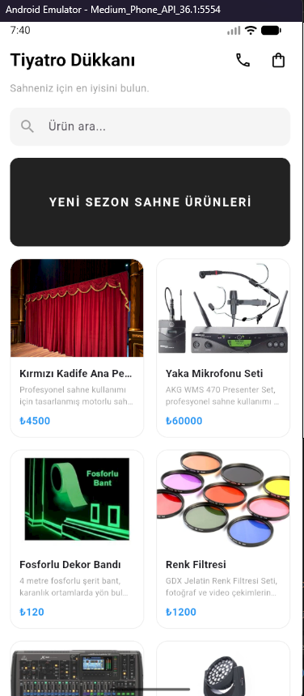
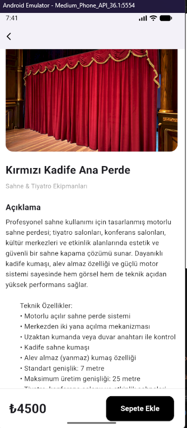
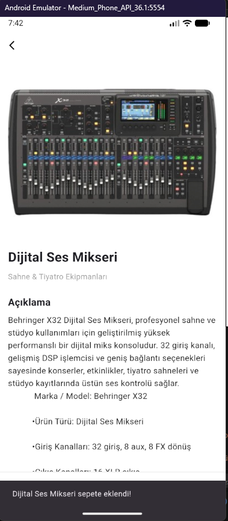
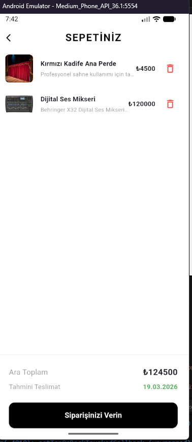
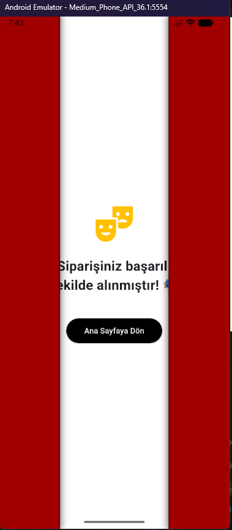
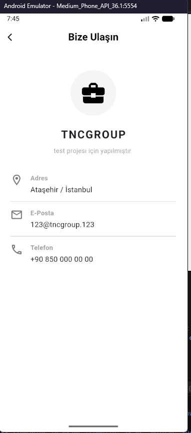

#  Sahne ve Tiyatro Ekipmanları Mağazası (Mini Katalog)

## Proje Hakkında
Bu proje, Flutter eğitimi kapsamında geliştirilmiş "Mini Katalog Uygulaması" projesidir. Standart örneklerin dışına çıkılarak, **TNCGROUP** konseptiyle profesyonel tiyatro ve sahne ekipmanlarının listelendiği  bir e-ticaret arayüzüdür. 

Projeye ekstra olarak;
* Dinamik sepet  (ürün ekleme, silme, anlık ara toplam hesaplama)
* Sepet bildirim balonu (Badge)
* Tiyatro perdesi açılış animasyonlu sipariş tamamlama ekranı
* Kurumsal iletişim sayfası eklenmiş .

## Kullanılan Sürüm ve Teknolojiler
* **Flutter Sürümü:** Flutter 3.(SDK)
* **Dart Sürümü:** Dart 3.
* **Ekstra Paketler:** Projede harici bir paket kullanılmadı.

## Çalıştırma Adımları
Projeyi kendi ortamınızda test etmek için aşağıdaki adımları izleyebilirsiniz:

1. Projeyi bilgisayarınıza klonlayın veya zip olarak indirip dizine çıkartın.
2. Terminal veya Komut İstemi'ni açarak proje dizinine gidin.
3. Gerekli altyapıyı kurmak için terminale şu komutu yazın:
   `flutter pub get`
4. Bilgisayarınıza bağlı bir fiziksel cihaz veya Android/iOS emülatörü çalıştırın.
5. Projeyi başlatmak için terminale şu komutu yazın:
   `flutter run`

## Ekran Görüntüleri

  
  
  

  
  
  

